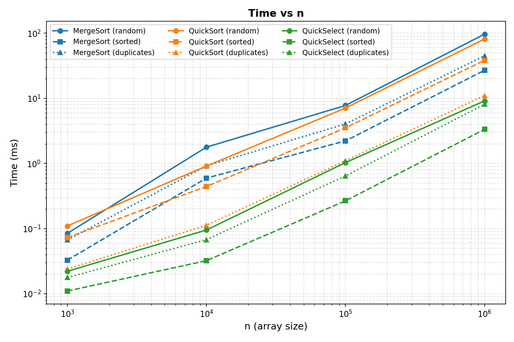
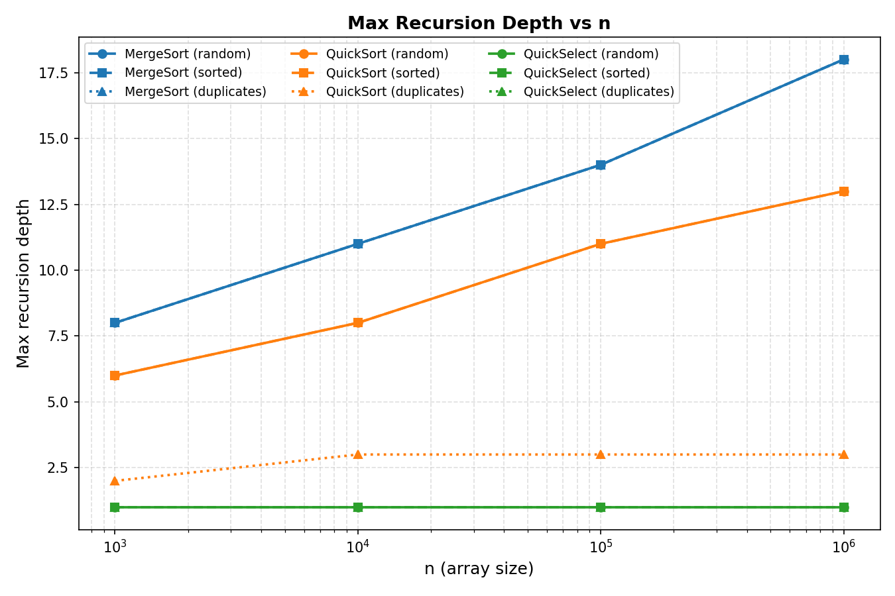
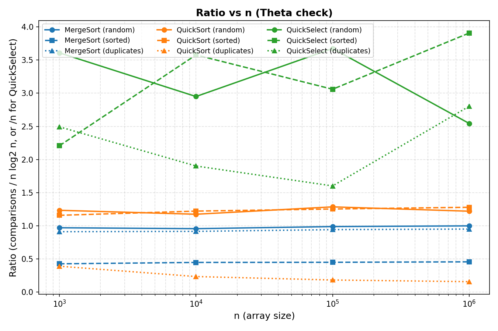

# DAA Assignment 1 — Report
## 1. Asymptotic Bounds
| Algorithm | Best case | Average case | Worst case |
|---|---|---|---|
| **Insertion Sort** | Θ(n) — array is already sorted, so the inner loop stops right away | Θ(n²) — random order, each element moves about halfway on average | Θ(n²) — array is sorted backwards, every element has to move all the way to the front |
| **MergeSort** | Θ(n log n) — always splits in half and merges in O(n), no matter the input | Θ(n log n) — same as best case, the input order does not change how the recursion works | Θ(n log n) — MergeSort never gets slower, it always splits evenly |
| **QuickSort** | Θ(n log n) — random pivot usually splits the array into two balanced halves | Θ(n log n) — because the pivot is random, the expected time is always n log n | O(n log n) — not tight, but our version always recurses into the smaller side first, so the recursion depth stays O(log n) even in a bad case |
| **QuickSelect** | Θ(n) — the pivot lands close to position k right away | Θ(n) — the work shrinks like n + n/2 + n/4 + ..., which adds up to O(n) | O(n) — in theory it could become O(n²) like QuickSort, but this is extremely unlikely with a random pivot |

**Note about QuickSort/QuickSelect worst case:**
A normal QuickSort that always picks a fixed pivot (like the last element) can become Θ(n²)
on some inputs, for example a sorted array. Our QuickSort picks the pivot randomly, so this
bad case almost never happens. We also always recurse into the smaller part first, so even
in the rare bad case, the recursion depth stays around O(log n) and the program never crashes
with a StackOverflowError. So the time can still theoretically be O(n²) in a very unlucky case,
but the recursion depth is always safe.
## 2. Recurrences
### MergeSort

T(n) = 2·T(n/2) + O(n)

- a = 2 (two recursive calls)
- b = 2 (each call gets half the array)
- f(n) = O(n) (merging two halves takes linear time)

Compare n^log_b(a) = n^log_2(2) = n^1 = n with f(n) = n. They are the same order,
so this is **Master Theorem Case 2**.

**Result: T(n) = Θ(n log n)**

### QuickSort (assuming a balanced split)

T(n) = 2·T(n/2) + O(n)

- a = 2 (two recursive calls, one for each side of the pivot)
- b = 2 (assuming the pivot splits the array into two equal halves)
- f(n) = O(n) (partitioning the array takes linear time)

Same as MergeSort: n^log_b(a) = n, which matches f(n) = n → **Master Theorem Case 2**.

**Result: T(n) = Θ(n log n)** (assuming balanced splits)

**Why does a random pivot give O(n log n) on average?**
A truly balanced split (exactly n/2 and n/2) almost never happens in practice. But with a
random pivot, the split does not need to be perfectly balanced to get O(n log n) — even a
pivot that lands anywhere between the 25th and 75th percentile is "good enough" and still
gives logarithmic recursion depth on average. Since a random pivot lands in that good range
about half the time, the bad splits get canceled out by the good ones, and the average total
work still comes out to O(n log n).

### QuickSelect (assuming a balanced split)

T(n) = T(n/2) + O(n)

- a = 1 (only ONE recursive call — we throw away the other half after partitioning)
- b = 2 (the array shrinks by half each time)
- f(n) = O(n) (partitioning still takes linear time)

Compare n^log_b(a) = n^log_2(1) = n^0 = 1 with f(n) = n. Here f(n) grows faster than
n^log_b(a), so this is **Master Theorem Case 3**.

**Result: T(n) = Θ(n)**

**Note:** This is a different Master Theorem case than MergeSort/QuickSort because QuickSelect
only recurses into ONE side after partitioning (a = 1), not both sides (a = 2). This is exactly
why QuickSelect is faster — the work shrinks geometrically (n + n/2 + n/4 + ... = O(n)) instead
of being multiplied by log n like in the sorting algorithms.

## 3. Plots

The first plot shows how long each algorithm takes as the array gets bigger.
The second plot shows how deep the recursion goes as the array gets bigger.
The third plot checks if the number of comparisons divided by the expected
growth (n log n for the sorts, n for QuickSelect) stays about the same as n grows.

## 4. Θ Check

Looking at the ratio plot (comparisons / (n·log2 n) for MergeSort and QuickSort,
comparisons / n for QuickSelect):

- **MergeSort:** the ratio stays close to 1.0 across all n (0.9 to 1.0). It is
  almost a flat line, which means the growth really is Θ(n log n).
  Rough constants: c1 ≈ 0.9, c2 ≈ 1.0, n0 ≈ 1000.

- **QuickSort:** the ratio stays close to 1.2 across all n (1.15 to 1.3).
  Also a flat line, confirming Θ(n log n).
  Rough constants: c1 ≈ 1.1, c2 ≈ 1.3, n0 ≈ 1000.

- **QuickSelect:** the ratio bounces around more (1.6 to 3.9) because the pivot
  is random and QuickSelect only does one partition step per level, so there is
  more randomness in a single run. But the ratio does not keep growing as n gets
  bigger, it just jumps around a fixed range. This still supports Θ(n),
  just with more noise because we only took the median of 5 runs.
  Rough constants: c1 ≈ 1.5, c2 ≈ 4.0, n0 ≈ 1000.

Overall, the flat lines for MergeSort and QuickSort are a strong confirmation
of the Θ(n log n) bound. QuickSelect is noisier but does not trend upward,
which supports Θ(n).

## 5. Discussion

The measurements mostly match the theory. MergeSort and QuickSort both grow
close to n log n, and QuickSelect grows close to n, just like the Master
Theorem predicted. MergeSort recursion depth and QuickSort recursion depth
were almost the same for random and sorted input, which shows the random
pivot is working well — it stops QuickSort from getting slow on sorted arrays.
QuickSort was clearly faster than MergeSort on the duplicates input, because
of the 3-way partition, which is exactly what it was designed for.

There are a few things that cause small differences between theory and real
numbers. JVM warm-up means the first runs are slower because the code has not
been optimized by the JIT compiler yet — this is why we take the median of 5
runs instead of the first run. Garbage Collection can randomly pause the
program and add extra time to a run, especially on the biggest arrays
(1,000,000 elements), which use more memory. CPU cache also plays a role —
smaller arrays fit better in the cache, so operations on them are faster per
element than the theory alone would suggest. Finally, the cutoff size (15
elements) means very small subarrays are sorted with Insertion Sort instead
of continuing the recursion, which slightly changes the constant factor but
not the overall growth rate.

## Bonus Task A: Median of Medians

`MedianOfMediansSelect` picks the pivot using median-of-medians instead of
a random pivot: split into groups of 5, sort each group, take medians,
recursively find the median of those medians. This guarantees the pivot
is never too far from the middle, giving O(n) worst-case time (not just
O(n) on average like regular QuickSelect).
Median-of-Medians uses about 2.5–3x more comparisons than QuickSelect —
the cost of guaranteeing a good pivot. Regular QuickSelect is faster in
practice since a random pivot is almost always good enough, but
Median-of-Medians is safer when the worst case must be avoided completely.

## Bonus Task B: Closest Pair of Points

`ClosestPair` finds the two closest points out of n points in O(n log n)
time. It sorts points by x, splits them in half, solves each half on its
own, then checks a small "strip" of points near the middle — only the
next 7 points for each one need to be checked.
We checked it against a slow brute-force method (checking every pair,
O(n²)) on 50 random tests — the answers always matched.
Both methods find the same answer, but the fast version uses about 75x
fewer comparisons than brute-force.